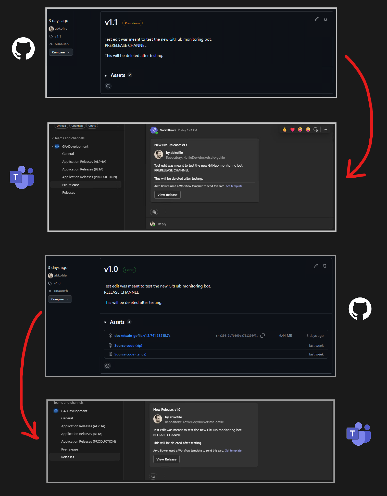
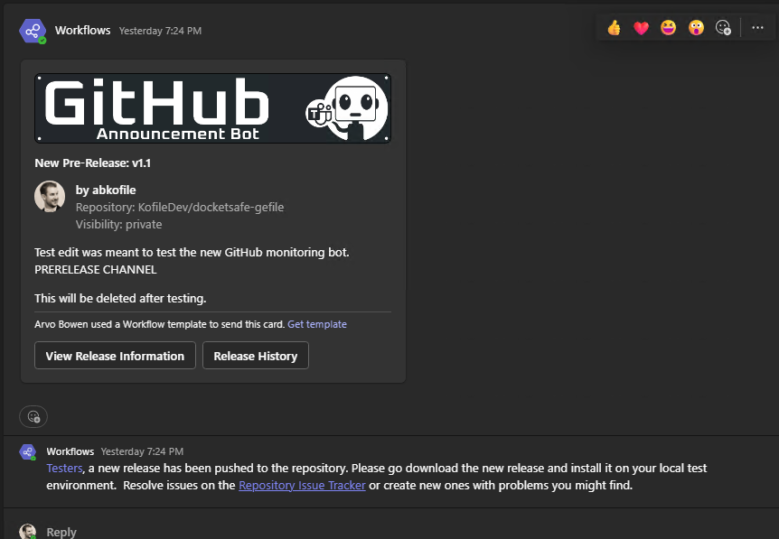

# SpiderGate Orb Module: Announcer - GitHub to Teams

This is a SpiderGate Orb that requires the dependancy `spider-gate` to run.  A simple and efficient Node.js application that listens for new GitHub releases and automatically posts formatted notifications to designated Microsoft Teams channels. It's designed to differentiate between full releases and pre-releases, routing notifications accordingly.

  

<h1 align="center">Announcer Orb: GitHub to Teams</h1>

  A SpiderGate Orb that listens for new GitHub releases and sends formatted notifications to Microsoft Teams channels.

---

## 🎯 About This Orb

This is an orb designed for the **[SpiderGate API Server](https://github.com/arvobowen/spider-gate)**. Its purpose is to provide a webhook endpoint that listens for release events from GitHub repositories and posts richly formatted notification cards to designated Microsoft Teams channels.

---

## ✨ Features

* ✅ **Real-time Notifications:** Uses GitHub webhooks to instantly detect when a new release is published.
* ✅ **Release & Pre-release Channels:** Intelligently sends notifications to separate Teams channels for official releases and pre-releases.
* ✅ **Richly Formatted Messages:** Posts clear and informative Adaptive Cards to Teams, including release name, author, repository, tag, and release notes.
* ✅ **Secure:** Verifies incoming webhook payloads using a shared secret to ensure authenticity.
* ✅ **Interactive Documentation:** Includes a Swagger UI page for easy testing and documentation.

---

## 🎬 Demonstration

---

## 🚀 Getting Started

This project is not a standalone application. It is designed to be run as a module within the **[SpiderGate API Server](https://github.com/arvobowen/spider-gate)**. Please follow the instructions in that repository for setup and installation.

### Configuration

To use this orb, you will need to add the following environment variables to your main server's `.env` file:

* `TEAMS_RELEASE_WEBHOOK_URL`: The full URL for the Incoming Webhook configured in your main "Releases" Teams channel.
* `TEAMS_PRERELEASE_WEBHOOK_URL`: The full URL for the Incoming Webhook configured in your "Pre-releases" Teams channel.
* `WEBHOOK_SECRET`: The strong, random string you created to secure your webhook payloads.